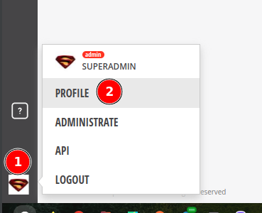
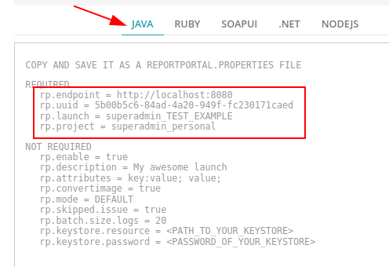

## Мануал по интеграции Report Portal в проект
1. Для запуска системы потребуются:
   1. установленные Docker и Docker Compose.
   2. Технические требования: [ссылка](https://reportportal.io/docs/Optimal-Performance-Hardware).
   3. VPN (запущенный в ОС) для загрузки контейнеров через Docker.

2. Настройки Gradle-проекта на JUnit5 (настройки взяты [ссылка](https://reportportal.io/installation)):
   1. В [build.gradle](../build.gradle) в блок `repositories` добавить репозиторий:
      ```groovy
      mavenLocal()
      ```
   2. В блок `dependencies` добавить следующие зависимости:
      ```groovy
      implementation 'com.epam.reportportal:agent-java-junit5:5.0.0'
      implementation 'com.epam.reportportal:logger-java-logback:5.0.2'
      implementation 'ch.qos.logback:logback-classic:1.2.3'
      ```
   3. В блок `test` добавить строки:
      ```groovy
      systemProperty 'junit.jupiter.extensions.autodetection.enabled', true
      testLogging.showStandardStreams = true
      ```
3. В папке `src/test/resources/`, создать папку `META-INF`, а в ней папку `services` в директории **_src/test/resources_** и поместить туда файл
4. В папку `META-INF/services/`, поместить файл: [org.junit.jupiter.api.extension.Extension](../src/test/resources/META-INF/services/org.junit.jupiter.api.extension.Extension)
5. В папку `src/test/resources/`, поместить файл: [logback.xml](../src/test/resources/logback.xml)
6. В папку `src/test/resources/`, поместить пустой файл: [reportportal.properties](../src/test/resources/reportportal.properties)
7. Создать класс: [LoggingUtils](../src/test/java/ru/netology/util/LoggingUtils.java)
8. Создать класс: [ScreenShooterReportPortalExtension](../src/test/java/ru/netology/util/ScreenShooterReportPortalExtension.java).
9. Над тестовым классом необходима аннотация `@ExtendWith({ScreenShooterReportPortalExtension.class})`.
   
   _Пример строки в тестах для записи в лог информации о произведенных действиях:_
   ```java
   logInfo("В поле" + userField + " введено значение " + nameValue);
   ```

10. В корневую папку проекта поместить файл: [docker-compose.yml](../docker-compose.yml), ([ссылка на оригинал](https://raw.githubusercontent.com/reportportal/reportportal/master/docker-compose.yml)).
11. Если ОС не Линукс, то в файле `docker-compose.yml` нужно раскомментировать строки касающиеся требуемой ОС и закомментировать касающиеся Линукс.
12. В терминале, в корне проекта, запустить команду:
   ```sh
   docker-compose -p reportportal up -d --force-recreate
   ```
   И дождаться скачивания и создания всех необходимых контейнеров.
13. Открыть ReportPortal в браузере: по адресу http://localhost:8080/.
14. Войти в учетную запись:
    ```json
    {
      "login": "superadmin",
      "password": "erebus"
    }
    ```
15. Из профиля пользователя

   

   скопировать 4 первые строчки

   
   
   в файл [reportportal.properties](../src/test/resources/reportportal.properties).
